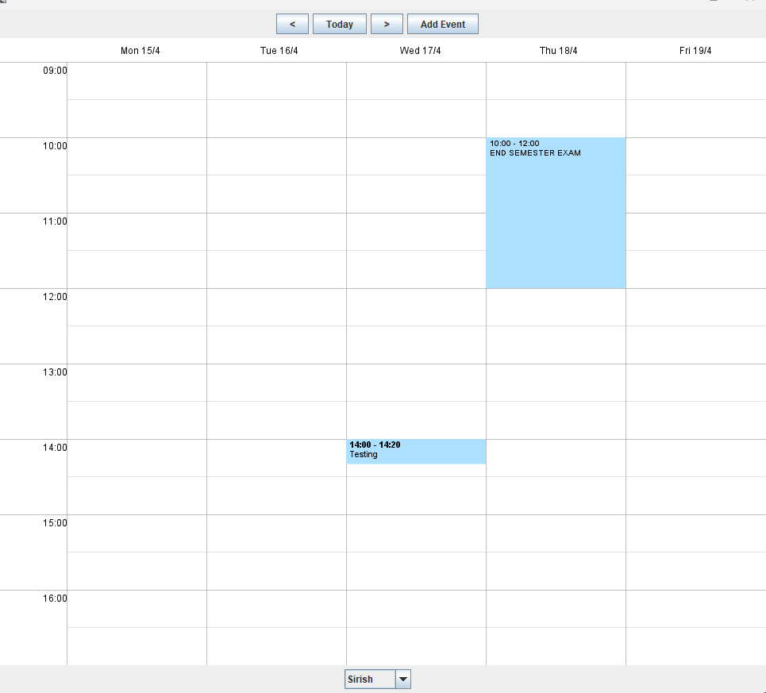
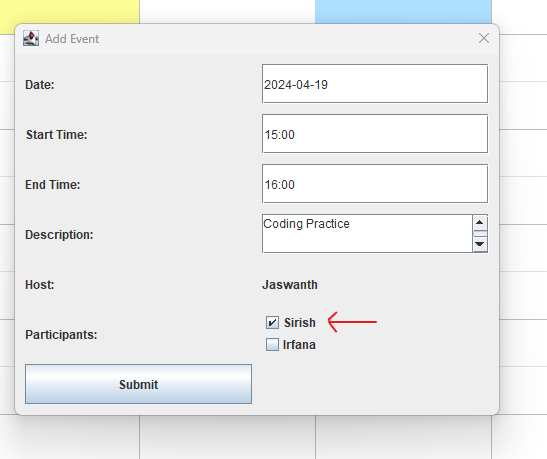
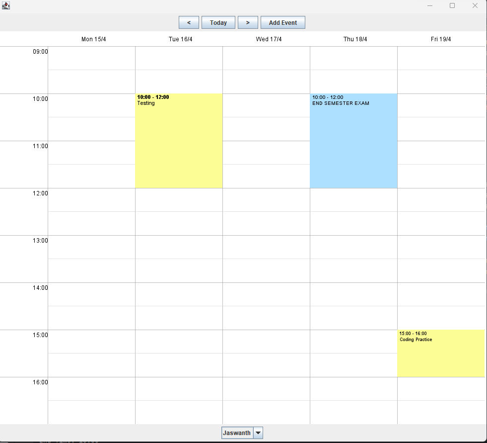
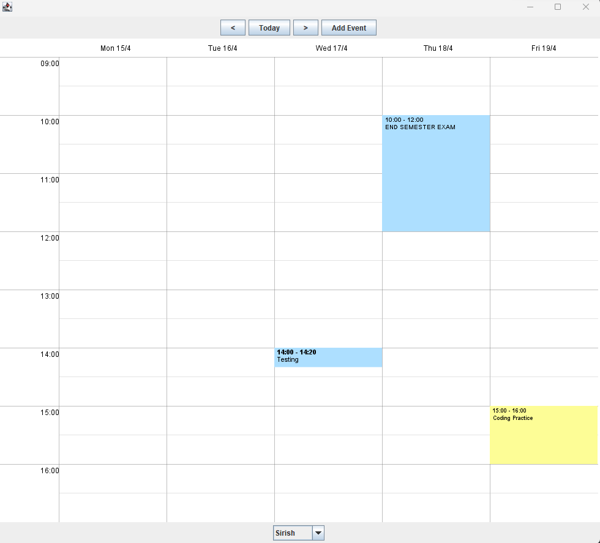
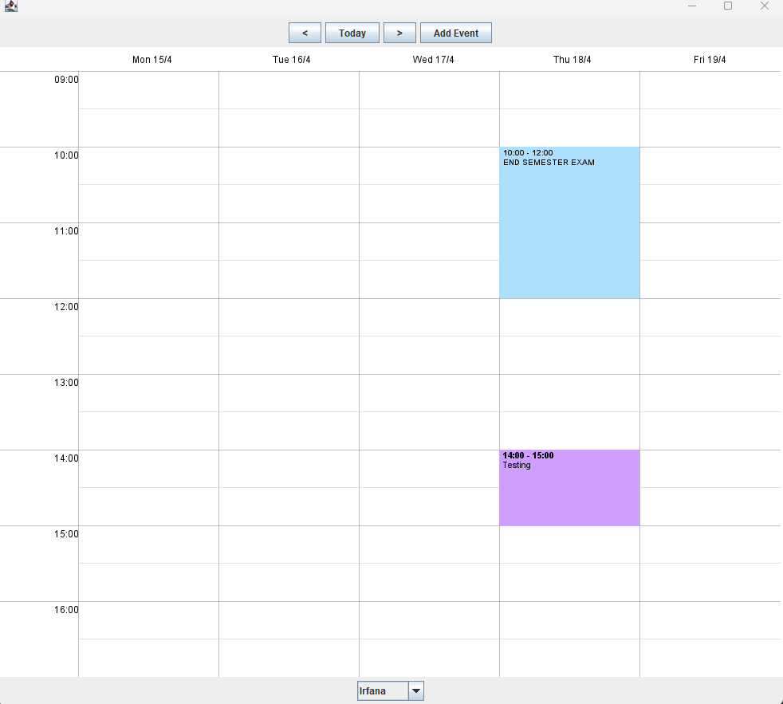

#### Calender - Java 

### Team members : 
- Sirish Chejerla
- Jaswanth Madha 
- Irfana Lnu 

### Screenshot demos :

### Page : 1

Page 2 : Adding Event Jaswanth as host and including only Sirish for the event

### Page 3 :  The newly addded event is reflected to respective users only

#### Jaswanth's Weekly Calendar 

#### Sirish's Weekly Calendar

#### Irfana's Weekly Calendar

#### MVC model Structure :
Files Categorized
Model: 
- Week.java
- User.java
- Calendar.java
- WeekCalendar.java

View : (used for GUI components )
- WeekCalendarTest.java

Controller :
- CalendarEventClickEvent
- CalendarEventClickListener
- CalendarEmptyClickEvent
- CalendarEmptyClickListener

